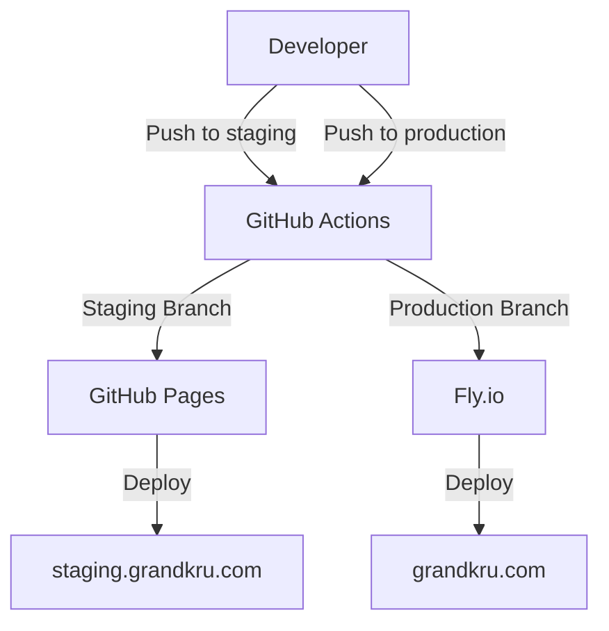

# AI Coding Agent Instructions for Grand Kru Technologies Website

## Overview
This repository contains the source code for the Grand Kru Technologies website, a modern single-page application (SPA) built with Vue 3 and Tailwind CSS. The project includes a staging environment (GitHub Pages) and a production environment (Fly.io).

### Key Components
- **Frontend Framework**: Vue 3
- **Styling**: Tailwind CSS
- **Build Tool**: Vite
- **Testing**: Vitest
- **Deployment**: GitHub Actions for CI/CD, GitHub Pages for staging, Fly.io for production

## Architecture
The project follows a GitHub Flow with a dedicated staging branch:
- **Staging**: Deployed to `staging.grandkru.com` via GitHub Pages.
- **Production**: Deployed to `grandkru.com` via Fly.io.

### Deployment Diagram


## Developer Workflows

### Local Development
1. Install dependencies:
   ```bash
   npm install
   ```
2. Start the development server:
   ```bash
   npm run dev
   ```
3. Run tests:
   ```bash
   npm run test
   ```

### Deployment
- **Staging**: Push to the `staging` branch.
- **Production**: Push to the `main` branch.

### Manual Deployment
- Staging:
  ```bash
  npm run build
  # Deploy to GitHub Pages
  ```
- Production:
  ```bash
  flyctl deploy --app grandkru
  ```

## Project-Specific Conventions
- **Branch Naming**: Use `feature/*` for new features and `fix/*` for bug fixes.
- **Commit Messages**: Follow the format `type: description (fixes #issue)`.
- **Testing**: Write unit tests for all new features and bug fixes.

## Key Files and Directories
- `src/`: Contains the Vue components and application logic.
- `public/`: Static assets.
- `vite.config.js`: Vite configuration.
- `Dockerfile`: Configuration for production container.
- `fly.toml`: Fly.io deployment configuration.
- `.github/workflows/deploy.yml`: GitHub Actions workflow for CI/CD.

## Environment Variables
- `VITE_EMAILJS_SERVICE_ID`
- `VITE_EMAILJS_TEMPLATE_ID`
- `VITE_EMAILJS_PUBLIC_KEY`
- `VITE_BASE_URL` (automatically set based on environment)

## External Dependencies
- **EmailJS**: Used for the contact form.
- **Fly.io**: Production hosting.
- **GitHub Pages**: Staging hosting.

## Testing
- Run all tests:
  ```bash
  npm run test
  ```
- Test files are located in `src/__tests__/` and follow the naming convention `*.spec.ts`.

## Troubleshooting
- Check GitHub Actions logs for CI/CD issues.
- Verify Fly.io app status:
  ```bash
  flyctl status --app grandkru
  ```
- Check Fly.io logs:
  ```bash
  flyctl logs --app grandkru
  ```
- Ensure environment variables are correctly set in GitHub Secrets.

---

For more details, refer to the [README.md](../README.md) and [DEVELOPMENT.md](../DEVELOPMENT.md) files.