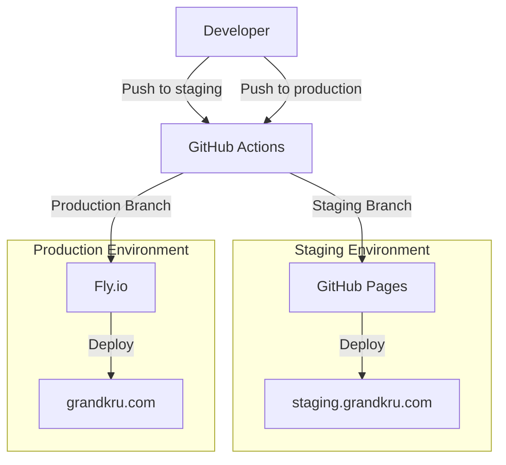

# Grand Kru Technologies – Development Guide

Based on the [mnyon-grandkru/DEVELOPMENT.md](https://github.com/mnyon-grandkru/DEVELOPMENT.md) template structure.

## Table of Contents

1. [Development Team Agreement Decisions](#development-team-agreement-decisions)
2. [Detailed Usage Instructions](#detailed-usage-instructions)
3. [Testing](#testing)
4. [Deployment](#deployment)
5. [Developer Cookbook](#developer-cookbook)
6. [Lightweight Architectural Decision Records](#lightweight-architectural-decision-records)

---

## Development Team Agreement Decisions

### Branch Strategy

- **`production`** – Production-ready code; push triggers auto-deploy to grandkru.com (Fly.io)
- **`staging`** – Integration branch; push triggers auto-deploy to staging.grandkru.com (GitHub Pages)
- **`<story-type>/*`** – Feature branches created from `staging`

### Workflow Principles

- **`production` is always deployable** – Only production-ready code goes here
- **Staging for integration** – Features tested together before production
- **Feature branches are short-lived** – Merge after review
- **Automated deployments** – Push to `staging` → auto-deploy to staging.grandkru.com; push to `production` → auto-deploy to grandkru.com (via GitHub Actions)

### Development Process (Per Change)

1. Create a GitHub issue with acceptance criteria
2. Create a branch with the issue number: `fix/40-description` or `feature/40-description`
3. Add tests that verify the change
4. Run `npm run test` to ensure no regressions
5. Push and create a PR to `staging` with `@gktreviewer` as reviewer

### PR Guidelines

- PR body: max 750 characters
- Include issue reference (e.g. `fixes #42`)
- Always include `@gktreviewer` as reviewer

---

## Detailed Usage Instructions

### Prerequisites

- Node.js v18.0.0 or higher (v20+ recommended for Wrangler)
- npm v8.0.0 or higher

### Project Structure

```
src/
├── assets/        # Static assets (images, logo)
├── components/    # Reusable Vue components
├── views/         # Page components
├── router/        # Vue Router configuration
├── plugins/       # Vuetify and other plugins
├── __tests__/     # Test files
└── App.vue        # Root component
```

### Getting Started

```bash
# Install dependencies
npm install

# Run development server
npm run dev

# Build for production
npm run build

# Preview production build
npm run preview
```

### Key Scripts

| Script | Purpose |
|--------|---------|
| `npm run dev` | Start Vite dev server with HMR |
| `npm run build` | Production build to `dist/` |
| `npm run preview` | Preview production build locally |
| `npm run test` | Run Vitest in watch mode |
| `npm run test:run` | Run Vitest once (CI) |
| `npm run test:ui` | Vitest UI |
| `npm run type-check` | Vue-tsc type checking |
| `npm run lint` | ESLint with auto-fix |

### Environment Variables

- `VITE_EMAILJS_SERVICE_ID` – EmailJS service
- `VITE_EMAILJS_TEMPLATE_ID` – EmailJS template
- `VITE_EMAILJS_PUBLIC_KEY` – EmailJS public key
- `VITE_BASE_URL` – Base path (e.g. `/` or `/staging/`)
- `VITE_ENVIRONMENT` – `staging` or `production`

---

## Testing

### Testing Strategy

Tests are run with **Vitest** and **Vue Test Utils**. All tests use the `.spec.ts` naming convention.

### Test Types

1. **Unit tests** – Components, composables, utilities
2. **Integration tests** – Router, views, flows
3. **Configuration tests** – Favicon, cursorrules, build config

### Running Tests

```bash
# Watch mode (development)
npm run test

# Single run (CI)
npm run test:run

# Interactive UI
npm run test:ui
```

### Test File Location and Naming

- Place tests in `src/__tests__/` or next to the module as `*.spec.ts`
- Use `.spec.ts` (not `.test.ts` or `.test.js`)

### Writing Tests

- Use `@vue/test-utils` for component tests
- Use `@testing-library/vue` for user-centric tests
- Mock external dependencies (e.g. EmailJS)
- Follow the pattern: arrange, act, assert

### Pre-Merge Requirements

- All tests must pass before merging
- New features and bug fixes must include tests
- Run `npm run test:run` before pushing

### Example Test Structure

```typescript
// src/components/__tests__/MyComponent.spec.ts
import { describe, it, expect } from 'vitest'
import { mount } from '@vue/test-utils'
import MyComponent from '../MyComponent.vue'

describe('MyComponent', () => {
  it('renders correctly', () => {
    const wrapper = mount(MyComponent, { props: { title: 'Test' } })
    expect(wrapper.text()).toContain('Test')
  })
})
```

---

## Deployment

### Deployment Architecture



### Environments

| Environment | Branch | Platform | URL |
|-------------|--------|----------|-----|
| Staging | `staging` | GitHub Pages | [staging.grandkru.com](https://staging.grandkru.com) |
| Production | `production` | Fly.io | [grandkru.com](https://grandkru.com) |

### Deployment Process

#### Staging

1. Create a feature branch from `staging`
2. Make changes, add tests, run `npm run test:run`
3. Push and open a PR to `staging`
4. After merge, GitHub Actions deploys to staging.grandkru.com

#### Production

1. Create a PR from `staging` → `production`
2. After merge, GitHub Actions automatically deploys to grandkru.com via Fly.io
3. No manual deploy step—push to `production` triggers the deployment

### Deployment Configuration

- **Staging:** `VITE_BASE_URL: '/staging/'`
- **Production:** `VITE_BASE_URL: '/'`
- **Build:** `npm run build`
- **Secrets:** `VITE_EMAILJS_*`, `FLY_API_TOKEN` (production)

### Cloudflare Workers (Alternative)

When using Cloudflare Workers (see [CLOUDFLARE_LESSONS_AND_DECISIONS.md](CLOUDFLARE_LESSONS_AND_DECISIONS.md)):

```bash
npm run build
npm run deploy   # wrangler deploy
```

### Deployment Verification

After each deployment:

1. Check GitHub Actions logs
2. Verify navigation, contact form, portfolio, responsive layout
3. Test in multiple browsers
4. Check browser console for errors

### Rollback

If issues are detected:

```bash
git checkout staging   # or production
git revert <commit-hash>
git push origin staging   # or production
```

GitHub Actions will redeploy the previous version. See the [Rollback Strategy](#rollback-strategy) section for details.

---

## Developer Cookbook

### Development Setup

1. **Install dependencies**
   ```bash
   npm install
   ```

2. **Run dev server**
   ```bash
   npm run dev
   ```

3. **Run tests**
   ```bash
   npm run test
   ```

### Component Guidelines

- Use Composition API with `<script setup lang="ts">`
- Follow the [Vue.js Style Guide](https://vuejs.org/style-guide/)
- Use Tailwind CSS for styling
- Aim for WCAG 2.1 accessibility

### CSS Guidelines

- Use Tailwind for utility-first styling
- Use CSS variables for theme colors
- Follow BEM for custom classes when needed

### Color Palette (Foxy Theme)

- Primary: `#2B4A6F` (steel blue)
- Secondary: `#5A5A5A` (gray)
- Accent: `#4A6B8A` (lighter blue)
- Background: `#fefefe`

### Adding a New Page

1. Create the view in `src/views/`
2. Add the route in `src/router/index.ts`
3. Add a navigation link in `src/components/Navigation.vue`
4. Add tests

### Portfolio Carousel

The portfolio uses `vue3-carousel`. Images go in `src/assets/portfolio/` with the pattern `[project]-[number].jpg`. Update the `images` array in the portfolio item data.

---

## Lightweight Architectural Decision Records

### ADR: GitHub Flow with Staging

**Context:** Need a simple workflow with a staging environment.

**Decision:** Use `production`, `staging`, and `feature/*` branches. Push to `staging` auto-deploys to GitHub Pages; push to `production` auto-deploys to Fly.io.

**Consequences:** Clear promotion path; staging validates before production.

### ADR: Vitest for Testing

**Context:** Need a fast, Vue-friendly test runner.

**Decision:** Use Vitest with Vue Test Utils and Testing Library.

**Consequences:** Native ESM, Vite integration, `.spec.ts` convention.

### ADR: Vuetify + Tailwind

**Context:** Need a component library and utility-first CSS.

**Decision:** Use Vuetify for components and Tailwind for layout and utilities.

**Consequences:** Consistent UI; possible class conflicts managed via safelist.

### ADR: Cloudflare Workers (Optional)

**Context:** Alternative deployment to Fly.io.

**Decision:** Support Cloudflare Workers via `@cloudflare/vite-plugin` and Wrangler. Worker serves static assets with SPA fallback.

**Consequences:** Edge deployment; see [CLOUDFLARE_LESSONS_AND_DECISIONS.md](CLOUDFLARE_LESSONS_AND_DECISIONS.md).

---

## Rollback Strategy

### Staging Rollback

```bash
git checkout staging
git revert <commit-hash>
git push origin staging
```

**Recovery time:** 2–5 minutes

### Production Rollback

```bash
git checkout production
git revert <commit-hash>
git push origin production
```

**Recovery time:** 5–10 minutes

### Emergency Hotfix

```bash
git checkout production
git checkout -b hotfix/emergency-fix
# Make minimal fix
git commit -m "hotfix: emergency production fix"
git push origin hotfix/emergency-fix
# Create PR to production
```

---

## Related Documentation

- [CLOUDFLARE_LESSONS_AND_DECISIONS.md](CLOUDFLARE_LESSONS_AND_DECISIONS.md) – Cloudflare Workers setup
- [CHANGES_2026-02-24.md](CHANGES_2026-02-24.md) – Recent changes log
- [README.md](README.md) – Project overview
