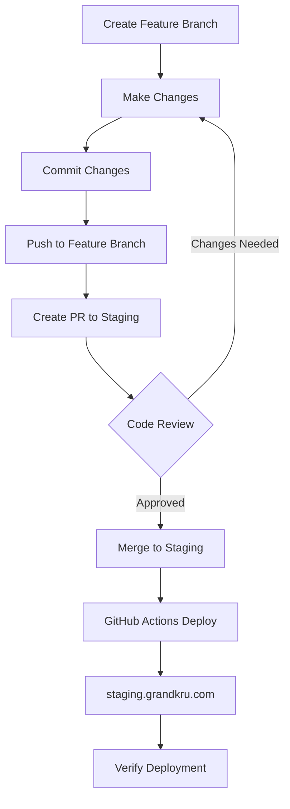
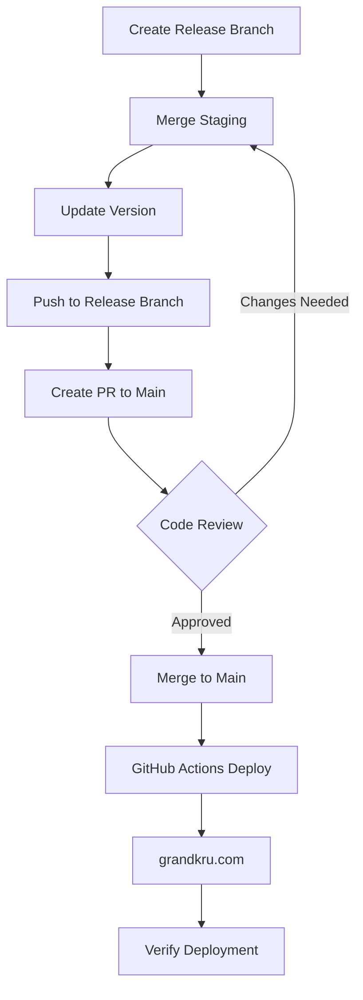
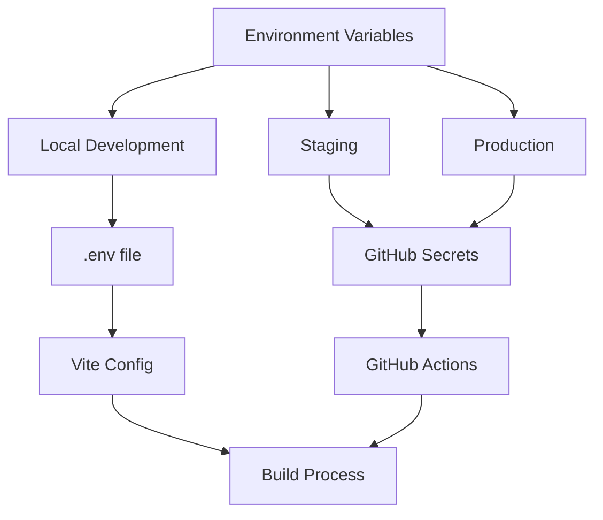

# Grandkru Technologies Development Guide

## Recent Changes (2024-03-19)

### EmailJS Integration
- Added EmailJS configuration for contact form
- Set up environment variables for EmailJS credentials
- Configured GitHub Actions secrets for production deployment
- Added local development environment support

### Environment Configuration
- Added `.env` file support for local development
- Configured Vite to load environment variables
- Set up GitHub Actions workflow with environment variables
- Added EmailJS environment variables:
  - `VITE_EMAILJS_SERVICE_ID`
  - `VITE_EMAILJS_TEMPLATE_ID`
  - `VITE_EMAILJS_PUBLIC_KEY`

### Debug Configuration
- Added debug logging for staging environment
- Configured Vite for better debugging
- Added environment information logging
- Set up router navigation logging

### Deployment
- Updated GitHub Actions workflow for staging deployment
- Added environment variable support in deployment
- Configured proper base URL handling for staging
- Added deployment URL output

## Deployment Process

### Deployment Flow Diagrams

#### Staging Deployment Flow


#### Production Deployment Flow


#### Environment Configuration Flow


### Staging Deployment (staging.grandkru.com)
1. Create a new branch from staging:
   ```bash
   git checkout staging
   git pull origin staging
   git checkout -b feature/your-feature-name
   ```

2. Make your changes and commit them:
   ```bash
   git add .
   git commit -m "feat: your feature description"
   ```

3. Push to staging:
   ```bash
   git push origin feature/your-feature-name
   ```

4. Create a Pull Request to staging branch
   - Review changes
   - Ensure all tests pass
   - Get code review approval

5. Merge to staging branch
   - GitHub Actions will automatically deploy to staging.grandkru.com
   - Verify deployment at https://staging.grandkru.com

### Production Deployment (grandkru.com)
1. Create a new branch from main:
   ```bash
   git checkout main
   git pull origin main
   git checkout -b release/version-number
   ```

2. Merge staging changes:
   ```bash
   git merge staging
   ```

3. Update version number in package.json
   ```bash
   npm version patch|minor|major
   ```

4. Push to main:
   ```bash
   git push origin release/version-number
   ```

5. Create a Pull Request to main branch
   - Review all changes from staging
   - Ensure all tests pass
   - Get code review approval

6. Merge to main branch
   - GitHub Actions will automatically deploy to grandkru.com
   - Verify deployment at https://grandkru.com

### Environment Variables
- Staging: Set in GitHub repository secrets
- Production: Set in GitHub repository secrets
- Local: Use `.env` file (not committed to repository)

### Deployment Verification
After each deployment:
1. Check deployment logs in GitHub Actions
2. Verify site functionality:
   - Navigation
   - Contact form
   - Portfolio carousel
   - Responsive design
3. Test in multiple browsers
4. Check console for errors

### Rollback Process
If issues are detected:
1. Revert the merge commit
2. Push the revert
3. GitHub Actions will automatically redeploy the previous version

## Color Palette

- Primary Blue: `#3b5a7b` (from logo center)
- White: `#fbfdfa`
- Dark Gray: `#464747`
- Medium Gray: `#818282`
- Black: `#060506`
- Light Gray: `#c3c4c4`

## Development Setup

### Prerequisites
- Node.js (v18.0.0 or higher recommended)
- npm (v8.0.0 or higher)

### Project Structure
```
src/
├── assets/        # Static assets (images, logo)
├── components/    # Reusable Vue components
├── views/         # Page components
├── router/        # Vue Router configuration
├── styles/        # Global styles and variables
└── App.vue        # Root component
```

### Getting Started
1. Install dependencies:
   ```bash
   npm install
   ```

2. Run development server:
   ```bash
   npm run dev
   ```

3. Build for production:
   ```bash
   npm run build
   ```

### Key Features
- Vue 3 with Composition API
- Vue Router for navigation
- Responsive design
- Mobile-friendly layout
- Accessible components
- Form validation
- Modal system for portfolio items

### Component Guidelines
- Use Composition API with `<script setup>`
- Follow Vue.js Style Guide
- Implement responsive design using Tailwind CSS
- Ensure WCAG 2.1 accessibility compliance

### CSS Guidelines
- Use Tailwind CSS for utility-first styling
- Custom CSS in component-specific files
- Follow BEM naming convention for custom classes
- Use CSS variables for theme colors

## Portfolio Carousel Implementation

The portfolio section uses `vue3-carousel` for displaying multiple images in a slideshow format. Here's how it's implemented:

### Dependencies
```bash
npm install vue3-carousel
```

### Component Usage
The carousel is implemented in `src/views/PortfolioView.vue` and includes:
- Automatic rotation (3-second interval)
- Navigation arrows
- Pagination dots
- Smooth transitions
- Responsive design

### Image Structure
Each portfolio item requires multiple images in the following format:
```
src/assets/portfolio/
├── ecommerce-1.jpg
├── ecommerce-2.jpg
├── ecommerce-3.jpg
├── travel-1.jpg
├── travel-2.jpg
├── travel-3.jpg
└── ...
```

### Configuration Options
The carousel is configured with:
```javascript
<Carousel
  :items-to-show="1"      // Number of items to show at once
  :wrap-around="true"     // Enable infinite scrolling
  :autoplay="3000"        // Auto-rotate every 3 seconds
  class="mb-8"
>
```

### Custom Styling
The carousel includes custom styling in the component:
```css
.carousel__item {
  min-height: 200px;
  width: 100%;
  border-radius: 8px;
  display: flex;
  justify-content: center;
  align-items: center;
}

.carousel__prev,
.carousel__next {
  box-sizing: content-box;
  border: 5px solid white;
}

.carousel__pagination-button {
  background-color: var(--primary);
}
```

### Adding New Images
To add new images to a portfolio item:
1. Add the images to `src/assets/portfolio/` with the naming convention `[project-name]-[number].jpg`
2. Update the `images` array in the portfolio item data:
```javascript
{
  title: 'Project Name',
  images: [
    '../assets/portfolio/project-1.jpg',
    '../assets/portfolio/project-2.jpg',
    '../assets/portfolio/project-3.jpg'
  ],
  // ... other project data
}
```

### Customization
The carousel can be customized by:
- Adjusting the `autoplay` value for different rotation speeds
- Modifying the `items-to-show` for different layouts
- Updating the CSS variables for different colors and styles
- Adding or removing navigation controls