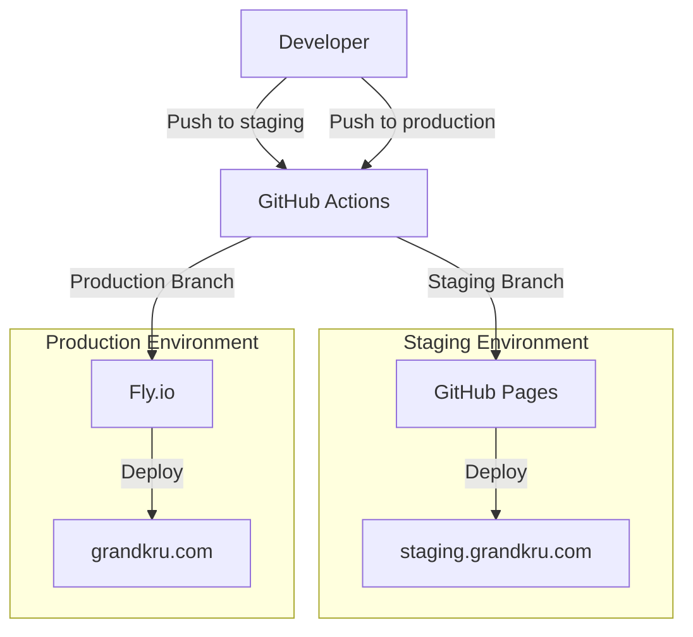

# grandkru.com

Grandkru Technologies is a modern, responsive single-page application (SPA) built with Vue 3 and Tailwind CSS. The website showcases the company's services, portfolio, and contact information with a clean, professional design inspired by the company logo and color palette.

## Key Features

- Client-side password protection for site access
- Responsive layout with a top navigation bar
- Animated page transitions
- Home, About, Services, Portfolio, and Contact pages
- Portfolio section with image carousel and modal case studies
- Accessible, mobile-friendly design
- Contact form with client-side validation
- Easy customization and extension

## Deployment Architecture



## Environments

- **Staging**: [staging.grandkru.com](https://staging.grandkru.com)
  - Branch: `staging`
  - Deployed via GitHub Pages
  - Base URL: `/staging/`

- **Production**: [grandkru.com](https://grandkru.com)
  - Branch: `production`
  - Deployed via Fly.io
  - Base URL: `/`

## Development

For detailed development guidelines, color palette, and component structure, see [DEVELOPMENT.md](DEVELOPMENT.md).

### Quick Start

1. Install dependencies:
   ```bash
   npm install
   ```

2. Run development server:
   ```bash
   npm run dev
   ```

3. Build for production:
   ```bash
   npm run build
   ```

### Deployment

The application is automatically deployed when changes are pushed to the respective branches:

- Push to `staging` branch for staging deployment
- Push to `production` branch for production deployment

For manual deployment instructions and troubleshooting, see [DEVELOPMENT.md](DEVELOPMENT.md#deployment-steps).

