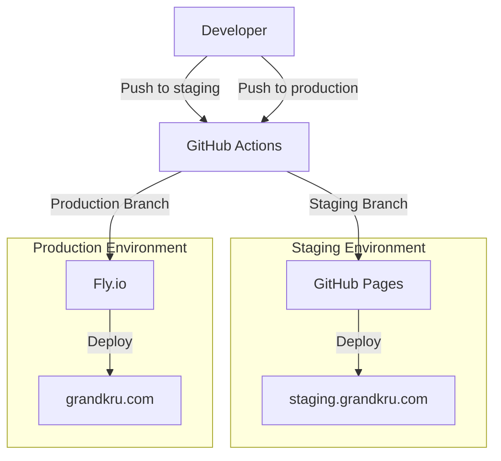
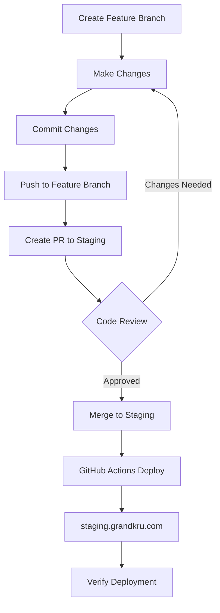
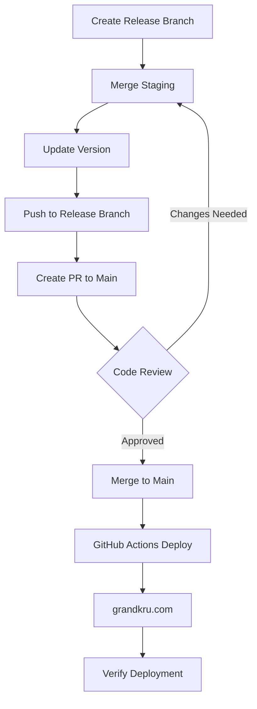
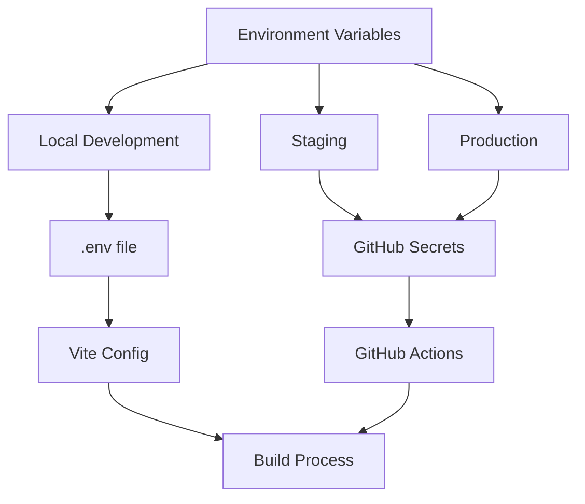

# Grandkru Technologies Website Development Guide

## Development & Deployment Workflow

This project follows a **GitHub Flow with Staging** approach, combining the simplicity of GitHub Flow with the safety of a staging environment.

### Branch Strategy

- **`main`** - Always contains production-ready code, automatically deploys to production
- **`staging`** - Integration branch for testing, automatically deploys to staging environment
- **`feature/*`** - Individual feature branches created from `staging`

### Workflow Steps

1. **Feature Development:**
   ```bash
   git checkout staging
   git pull origin staging
   git checkout -b feature/your-feature-name
   # Make changes, commit, push
   git push origin feature/your-feature-name
   ```

2. **Staging Review:**
   - Create PR from `feature/*` → `staging`
   - Code review and testing
   - Merge to `staging` → auto-deploys to [staging.grandkru.com](https://staging.grandkru.com)

3. **Production Release:**
   - Create PR from `staging` → `main`
   - Final review and approval
   - Merge to `main` → auto-deploys to [grandkru.com](https://grandkru.com)

### Development Process Workflow

**For every change, follow this process:**

1. **Create a new GitHub issue**
   - Describe the problem or feature request
   - Include acceptance criteria if applicable

2. **Create a new branch with the issue number**
   ```bash
   git checkout -b fix/40-description
   # or
   git checkout -b feature/40-description
   ```

3. **Create a test to verify the change functionality**
   - Write tests that confirm the change works as expected
   - For UI changes, test the visual/functional aspects
   - For bug fixes, test that the issue is resolved

4. **Run `npm run test` to ensure no regression errors**
   ```bash
   npm run test
   ```
   - All existing tests should pass
   - New tests should verify the changes

5. **Push to a remote branch**
   ```bash
   git add .
   git commit -m "feat: description (fixes #40)"
   git push --set-upstream origin fix/40-description
   ```

6. **Create a PR based off staging with gktreviewer as reviewer**
   ```bash
   gh pr create --base staging --head fix/40-description --title "feat: description (fixes #40)" --body "Description of changes\n\nFixes #40\n\nReviewer: @gktreviewer"
   ```

### Key Principles

- **`main` is always deployable** - Only production-ready code goes here
- **Staging for integration** - All features are tested together before production
- **Feature branches are short-lived** - Merge quickly after review
- **Automated deployments** - No manual deployment steps needed

### Comparison to Standard Workflows

| Aspect | Git Flow | GitHub Flow | Our Workflow |
|--------|----------|-------------|--------------|
| Branches | main, develop, feature, release, hotfix | main, feature | main, staging, feature |
| Staging | develop branch | main (production) | dedicated staging branch |
| Releases | release branches | direct to main | staging → main |
| Complexity | High | Low | Medium |
| Safety | High | Medium | High |

---

For a detailed history of changes, see [CHANGELOG.md](CHANGELOG.md).

## Deployment Architecture



## Deployment Configuration
- **Staging (GitHub Pages)**
  - Branch: `staging`
  - Domain: `staging.grandkru.com`
  - Base URL: `/staging/`
  - Build Command: `npm run build`
  - Deploy Command: GitHub Pages deployment

- **Production (Fly.io)**
  - Branch: `production`
  - Domain: `grandkru.com`
  - Base URL: `/`
  - Build Command: `npm run build`
  - Deploy Command: `flyctl deploy`

## Required Files
```
├── .github/workflows/deploy.yml  # GitHub Actions workflow
├── Dockerfile                    # Production container config
├── nginx.conf                    # Nginx server config
├── fly.toml                      # Fly.io config
└── vite.config.js               # Vite build config
```

## Environment Variables
- `VITE_EMAILJS_SERVICE_ID`
- `VITE_EMAILJS_TEMPLATE_ID`
- `VITE_EMAILJS_PUBLIC_KEY`
- `VITE_BASE_URL` (automatically set based on environment)

## Deployment Steps
1. **Staging Deployment**
   ```bash
   git checkout staging
   git push origin staging
   ```

2. **Production Deployment**
   ```bash
   git checkout production
   git push origin production
   ```

3. **Manual Deployment (if needed)**
   ```bash
   # Staging
   npm run build
   # Deploy to GitHub Pages

   # Production
   flyctl deploy --app grandkru
   ```

## Troubleshooting
- Check GitHub Actions workflow logs
- Verify Fly.io app status: `flyctl status --app grandkru`
- Check Fly.io logs: `flyctl logs --app grandkru`
- Verify environment variables in GitHub Secrets
- Check DNS configuration for both domains

## Deployment Process

### Deployment Flow Diagrams

#### Staging Deployment Flow


#### Production Deployment Flow


#### Environment Configuration Flow


### Staging Deployment (staging.grandkru.com)
1. Create a new branch from staging:
   ```bash
   git checkout staging
   git pull origin staging
   git checkout -b feature/your-feature-name
   ```

2. Make your changes and commit them:
   ```bash
   git add .
   git commit -m "feat: your feature description"
   ```

3. Push to staging:
   ```bash
   git push origin feature/your-feature-name
   ```

4. Create a Pull Request to staging branch
   - Review changes
   - Ensure all tests pass
   - Get code review approval

5. Merge to staging branch
   - GitHub Actions will automatically deploy to staging.grandkru.com
   - Verify deployment at https://staging.grandkru.com

### Production Deployment (grandkru.com)
1. Create a new branch from main:
   ```bash
   git checkout main
   git pull origin main
   git checkout -b release/version-number
   ```

2. Merge staging changes:
   ```bash
   git merge staging
   ```

3. Update version number in package.json
   ```bash
   npm version patch|minor|major
   ```

4. Push to main:
   ```bash
   git push origin release/version-number
   ```

5. Create a Pull Request to main branch
   - Review all changes from staging
   - Ensure all tests pass
   - Get code review approval

6. Merge to main branch
   - GitHub Actions will automatically deploy to grandkru.com
   - Verify deployment at https://grandkru.com

### Environment Variables
- Staging: Set in GitHub repository secrets
- Production: Set in GitHub repository secrets
- Local: Use `.env` file (not committed to repository)

### Deployment Verification
After each deployment:
1. Check deployment logs in GitHub Actions
2. Verify site functionality:
   - Navigation
   - Contact form
   - Portfolio carousel
   - Responsive design
3. Test in multiple browsers
4. Check console for errors

### Rollback Process
If issues are detected:
1. Revert the merge commit
2. Push the revert
3. GitHub Actions will automatically redeploy the previous version

## Color Palette

- Primary Blue: `#3b5a7b` (from logo center)
- White: `#fbfdfa`
- Dark Gray: `#464747`
- Medium Gray: `#818282`
- Black: `#060506`
- Light Gray: `#c3c4c4`

## Development Setup

### Prerequisites
- Node.js (v18.0.0 or higher recommended)
- npm (v8.0.0 or higher)

### Project Structure
```
src/
├── assets/        # Static assets (images, logo)
├── components/    # Reusable Vue components
├── views/         # Page components
├── router/        # Vue Router configuration
├── styles/        # Global styles and variables
└── App.vue        # Root component
```

### Getting Started
1. Install dependencies:
   ```bash
   npm install
   ```

2. Run development server:
   ```bash
   npm run dev
   ```

3. Build for production:
   ```bash
   npm run build
   ```

### Key Features
- Vue 3 with Composition API
- Vue Router for navigation
- Responsive design
- Mobile-friendly layout
- Accessible components
- Form validation
- Modal system for portfolio items

### Component Guidelines
- Use Composition API with `<script setup>`
- Follow Vue.js Style Guide
- Implement responsive design using Tailwind CSS
- Ensure WCAG 2.1 accessibility compliance

### CSS Guidelines
- Use Tailwind CSS for utility-first styling
- Custom CSS in component-specific files
- Follow BEM naming convention for custom classes
- Use CSS variables for theme colors

## Portfolio Carousel Implementation

The portfolio section uses `vue3-carousel` for displaying multiple images in a slideshow format. Here's how it's implemented:

### Dependencies
```bash
npm install vue3-carousel
```

### Component Usage
The carousel is implemented in `src/views/PortfolioView.vue` and includes:
- Automatic rotation (3-second interval)
- Navigation arrows
- Pagination dots
- Smooth transitions
- Responsive design

### Image Structure
Each portfolio item requires multiple images in the following format:
```
src/assets/portfolio/
├── ecommerce-1.jpg
├── ecommerce-2.jpg
├── ecommerce-3.jpg
├── travel-1.jpg
├── travel-2.jpg
├── travel-3.jpg
└── ...
```

### Configuration Options
The carousel is configured with:
```javascript
<Carousel
  :items-to-show="1"      // Number of items to show at once
  :wrap-around="true"     // Enable infinite scrolling
  :autoplay="3000"        // Auto-rotate every 3 seconds
  class="mb-8"
>
```

### Custom Styling
The carousel includes custom styling in the component:
```css
.carousel__item {
  min-height: 200px;
  width: 100%;
  border-radius: 8px;
  display: flex;
  justify-content: center;
  align-items: center;
}

.carousel__prev,
.carousel__next {
  box-sizing: content-box;
  border: 5px solid white;
}

.carousel__pagination-button {
  background-color: var(--primary);
}
```

### Adding New Images
To add new images to a portfolio item:
1. Add the images to `src/assets/portfolio/` with the naming convention `[project-name]-[number].jpg`
2. Update the `images` array in the portfolio item data:
```javascript
{
  title: 'Project Name',
  images: [
    '../assets/portfolio/project-1.jpg',
    '../assets/portfolio/project-2.jpg',
    '../assets/portfolio/project-3.jpg'
  ],
  // ... other project data
}
```

### Customization
The carousel can be customized by:
- Adjusting the `autoplay` value for different rotation speeds
- Modifying the `items-to-show` for different layouts
- Updating the CSS variables for different colors and styles
- Adding or removing navigation controls

## Rollback Strategy

### Overview
This project implements a multi-layered rollback strategy to ensure quick recovery from deployment issues across both staging and production environments.

### Rollback Scenarios

#### 1. Staging Environment Rollback
**When:** Issues detected in staging environment
**Method:** Git revert or branch reset

```bash
# Option A: Revert the problematic commit
git checkout staging
git revert <commit-hash>
git push origin staging

# Option B: Reset to previous working state
git checkout staging
git reset --hard <previous-commit-hash>
git push --force-with-lease origin staging
```

**Recovery Time:** 2-5 minutes (GitHub Pages deployment)

#### 2. Production Environment Rollback
**When:** Issues detected in production after 24-hour promotion
**Method:** Revert to previous production state

```bash
# Revert the production deployment
git checkout main
git revert <production-commit-hash>
git push origin main

# Alternative: Emergency rollback to specific version
git checkout main
git reset --hard <known-good-commit>
git push --force-with-lease origin main
```

**Recovery Time:** 5-10 minutes (Fly.io deployment)

#### 3. Emergency Hotfix Rollback
**When:** Critical production issues requiring immediate fix
**Method:** Direct hotfix branch

```bash
# Create emergency hotfix
git checkout main
git checkout -b hotfix/emergency-fix
# Make minimal fix
git commit -m "hotfix: emergency production fix"
git push origin hotfix/emergency-fix

# Create PR directly to main (bypass staging)
# After approval and merge, auto-deploy to production
```

**Recovery Time:** 10-15 minutes (including review)

### Rollback Triggers

#### Automatic Rollback Conditions
- **Build failures** - Deployment automatically cancelled
- **Health check failures** - Automatic rollback to previous version
- **Performance degradation** - Manual trigger based on monitoring

#### Manual Rollback Triggers
- **User-reported issues** - Customer support escalations
- **Monitoring alerts** - Error rate spikes, response time increases
- **Security concerns** - Vulnerability discoveries
- **Business impact** - Revenue or user experience issues

### Rollback Verification

#### Pre-Rollback Checklist
- [ ] Identify the problematic commit/feature
- [ ] Confirm the issue is deployment-related
- [ ] Check if the issue exists in staging
- [ ] Verify rollback target (previous working version)
- [ ] Notify stakeholders of rollback plan

#### Post-Rollback Verification
- [ ] Verify deployment completed successfully
- [ ] Check application health and functionality
- [ ] Monitor error rates and performance metrics
- [ ] Confirm issue is resolved
- [ ] Update incident documentation

### Rollback Communication

#### Internal Communication
```markdown
**Rollback Alert**
- Environment: [Staging/Production]
- Issue: [Brief description]
- Rollback Target: [Commit hash/version]
- Expected Recovery Time: [X minutes]
- Status: [In Progress/Completed]
```

#### External Communication (if needed)
- Update status page
- Notify key stakeholders
- Prepare customer communication if necessary

### Rollback Prevention

#### Pre-Deployment Safeguards
- **Automated testing** - All tests must pass before deployment
- **Staging validation** - 24-hour staging period for testing
- **Code review** - All changes reviewed before merge
- **Performance monitoring** - Baseline performance tracking

#### Deployment Safeguards
- **Health checks** - Automated health verification post-deployment
- **Gradual rollout** - Feature flags for controlled releases
- **Monitoring alerts** - Real-time issue detection
- **Backup strategies** - Database and configuration backups

### Rollback Tools and Commands

#### GitHub Actions Rollback
```bash
# Trigger manual rollback workflow
gh workflow run rollback.yml --field environment=production --field commit=<commit-hash>
```

#### Fly.io Rollback
```bash
# Rollback to previous deployment
flyctl deploy --image-label <previous-version>

# Check deployment history
flyctl releases list --app grandkru

# Rollback to specific release
flyctl deploy --release-id <release-id>
```

#### Database Rollback (if applicable)
```bash
# Restore from backup (if database changes were made)
# This would depend on your database setup
```

### Rollback Documentation

#### Incident Report Template
```markdown
## Rollback Incident Report

**Date:** [Date/Time]
**Environment:** [Staging/Production]
**Issue Description:** [What went wrong]
**Root Cause:** [Why it happened]
**Rollback Action:** [What was done]
**Recovery Time:** [How long it took]
**Prevention Measures:** [How to prevent recurrence]
**Lessons Learned:** [Key takeaways]
```

### Rollback Metrics

Track the following metrics to improve rollback processes:
- **Mean Time to Detection (MTTD)** - How quickly issues are identified
- **Mean Time to Recovery (MTTR)** - How quickly rollbacks complete
- **Rollback Frequency** - How often rollbacks occur
- **Rollback Success Rate** - Percentage of successful rollbacks

---